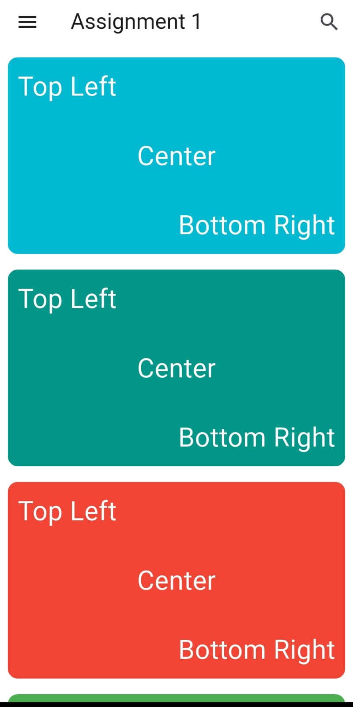
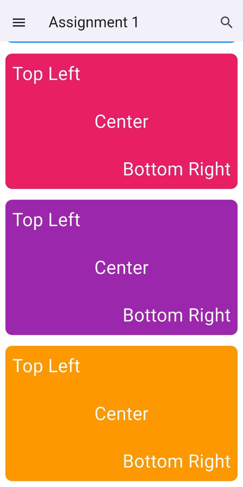

# 🧮 Flutter Layout Assignment – UI Only

A simple yet well-structured Flutter UI assignment designed as part of a layout exercise. The app displays multiple color-coded containers with text aligned to **top-left**, **center**, and **bottom-right** positions — showcasing the usage of Flutter's layout widgets like `Row`, `Column`, `Expanded`, `Align`, and `Container`.

---

## ✨ Features

- 🧱 Clean layout using core Flutter widgets  
- 📐 Demonstrates positioning inside containers  
- 🎨 Each container has a different background color  
- 📱 Responsive design with scroll support  
- ✅ Perfect for learning alignment & layout principles

---

## 📸 Screenshot

| UI Preview |
|------------|
|  |
|  |


---

## ⚙️ How to Run

1. **Clone the Repository**
   ```bash
   git clone https://github.com/yourusername/flutter-layout-assignment.git
